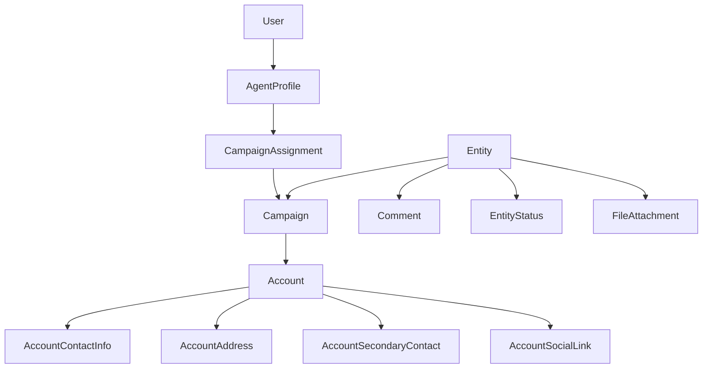

# 02 — Architecture

Owns: auth vs operations, security hierarchy, campaign scoping principle.  
Domain fields → [03](03-domain-model.md). Permissions/audit → [05](05-security.md). Stack → [07](07-technical-standards.md). UI patterns → [06](06-ui-standards.md).

## Application shape

One **Laravel monolith** in this repo (not a detached frontend). UI via Inertia + Vue + shadcn-vue + TanStack Table. No microservices split in Phase 1.

| Layer | Responsibility |
|-------|----------------|
| Controllers + Form Requests | HTTP, validation |
| Policies / Gates | Authorization |
| Services (when needed) | Multi-model workflows |
| Eloquent | Persistence |
| Inertia + Vue + shadcn-vue + TanStack Table | UI |
| MariaDB | System of record |

## Auth vs operations

| Concept | Role |
|---------|------|
| User | Identity / authentication only |
| Agent Profile | Operational actor |
| Campaign Assignment | Security boundary (who may access which campaigns) |
| Entity | Top-level CRM master (has many Campaigns) |
| Campaign | Work container under one Entity |
| Account | Account under one Campaign |

Users never own business records. Operators work as Agent Profiles. Access derives from Campaign Assignment (+ role permissions).

**Vocabulary:** Entity is never labeled Client or Customer. Account is never labeled Contract/Client. Details → [03](03-domain-model.md).

## Business records

| Record | Role |
|--------|------|
| Entity | Master record; owns Campaigns; Entity-level comments/history/files |
| Account (Account Master) | Account under a Campaign |
| Account Contact Info | Multi email / phone / landline / fax |
| Account Address | Multi addresses |
| Account Secondary Contact | Multi related people |
| Account Social Link | Multi social/web URLs |
| Comment / Status History / File | Entity-level supporting data |
| Report / Export outputs | Derived, audited extractions |

Account Master is a **primary** business record, not a UI footnote.

## Security hierarchy



```
User → Agent Profile → Campaign Assignment → Campaign
Entity → Campaign → Account
                              ├── Contact Info
                              ├── Addresses
                              ├── Secondary Contacts
                              └── Social Links
```

### Cardinality

- `User 1 — 0..1 AgentProfile` (admins may omit profile; operators should have one)
- `Entity 1 —< Campaign`
- `Campaign 1 —< Account`
- `Campaign 1 —< CampaignAssignment >— 1 AgentProfile` (never assign campaigns to Users)

## Access resolution

1. Authenticate User  
2. Check role permission for the action  
3. Super Admin → bypass campaign filter  
4. Else resolve Agent Profile → assigned campaign IDs  
5. Scope query; deny out-of-scope IDs (including Account children)

## Campaign scoping

| Record | Scope rule |
|--------|------------|
| Campaign | Assigned campaign IDs only |
| Account (+ children) | Via `campaign_id` in assigned set |
| Entity | Visible if Super Admin, or if Entity has ≥1 Campaign in the assigned set |
| Entity Comments / History / Files | Same visibility as parent Entity |
| Reports / Exports / dashboard | Honor the same rules |

One shared mechanism — not ad-hoc per controller. Details and audit rules: [05](05-security.md).

## Logical module areas

| Area | Modules |
|------|---------|
| Access | Auth, Users, Roles, Agent Profiles |
| CRM masters | Entities, Campaigns, Campaign Assignment, Account Master (+ children), Statuses, Entity comments/history/files |
| Insights | Dashboard, Reports |
| Data movement | Import, Export |
| Governance | Audit Logs, Settings |

Feature catalog: [04](04-modules.md).

## Layering preference

1. Controller + Form Request + Policy + Eloquent  
2. Service for multi-model workflows  
3. Repository only when justified  

## Extension rule

Future communication modules attach to Entity / Campaign / **Account** / Agent Profile. Do not move ownership onto User. Do not rename Account Master to “Contracts,” or Entity to “Client”/“Customer.”
