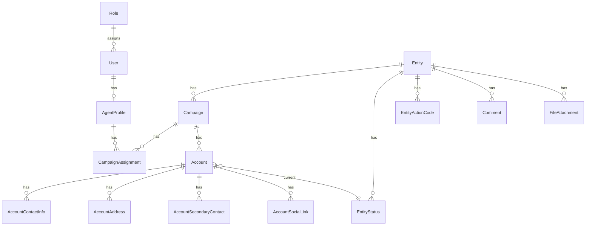

# 03 — Domain Model

Owns: entities, fields, relationships, schema conventions.  
Permissions → [05](05-security.md). Module UX → [04](04-modules.md) / [06](06-ui-standards.md).

## Vocabulary (locked)

| Term | Meaning |
|------|---------|
| **Entity** | The only name for the organization/person master record |
| **Campaign** | Work container under one Entity |
| **Account** | Account under one Campaign (Account Master module) |

**Forbidden synonyms in docs, UI labels, columns, and exports:** Client, Customer, Contracts (for Account).  
If you mean Entity, write **Entity**. If you mean Account, write **Account**.

## Ownership

Users do not own business records. Agent Profiles operate. Campaign Assignment bounds which **Campaigns** (and thus Accounts under them) are visible. Hierarchy:

```
Entity → Campaign → Account → child rows
```

## ER overview



## Access domain

### User

Username, Password, First Name, Last Name, Email, Mobile, Role, Status.  
`User 1 — 0..1 AgentProfile`.

### Role / Permission

Example roles: Super Administrator, Administrator, Supervisor, Agent, Viewer.  
CRUD + export (+ purge where applicable) per module — keys in [05](05-security.md).

### Agent Profile

Employee Number, First Name, Last Name, Display Name, Position, Department, Mobile, Email, Status, Notes.  
Future comms modules reference Agent Profile, not User.

### Campaign

FKs: `entity_id` (required).  
Fields: Campaign Code, Name, Description, Status. Operations: create, edit, archive, delete (hard cascade of Accounts).  
Belongs to exactly one Entity. Has many Accounts. Assignment of Agent Profiles via Campaign Assignment. Campaign Show lists Agents (not Accounts).

### Campaign Assignment

FKs: `campaign_id`, `agent_profile_id` (unique pair). Assignment UI from Campaign and Agent Profile sides.

## CRM domain

### Entity

Top-level master: Entity Code, Name, optional light identity fields, Custom Fields, audit actors/dates.  
Has many Campaigns. Owns per-entity catalogs: **Entity Status**, **Entity Action Codes**, **Templates**, and **Knowledge Groups** (with Knowledge Center items managed on Knowledge Group Show). Entity has no global Status field.  
Rich multi-contact/address/social data lives on **Account**, not as a flat Entity contacts module.

Hard delete (type entity name to confirm) cascade-deletes Campaigns and Accounts (and children) via DB FKs.

Statistics (CRM-only): created/updated by/dates, last comment — no communication stats.

Entity view tabs: Profile · Campaigns · Entity Statuses · Entity Action Codes · Templates · Knowledge Groups · (+ later Comments · History · Files · Statistics). Knowledge Center items: drill-down via Knowledge Group View.

### Entity Status / Entity Action Code

Per-entity lookup catalogs (`entity_statuses`, `entity_action_codes`): name, optional code, sort order, active flag. Unique name per entity. CRUD on Entity View.

Entity Action Codes also require a **classification**: `positive` | `negative` | `neutral`. Used when logging Account activities.

### Entity Template

Per-entity message templates (`entity_templates`): channel types (`sms` / `email` / `chat`, multi-select), unique slug per entity, body text, active flag. CRUD on Entity View. Body may include `{variable}` placeholders (e.g. `{account_name}`); Collectimate can resolve available Account fields when the template is used. Catalog storage only — not a messaging product.

When logging an Account activity with type SMS Send, Email Send, or Chat Send, an optional `entity_template_id` may reference an active template for that entity whose `types` include the matching channel (`sms` / `email` / `chat`). Shown on activity cards; not a send product.

### Entity Knowledge Group / Knowledge Item

Per-entity knowledge repository (catalog storage only — not AI/RAG/auto-reply).

**Knowledge Group** (`entity_knowledge_groups`): name (unique per entity), optional code, description, sort order, active flag, `is_default`. Every Entity has exactly one **Default** group (seeded on create). Default cannot be deleted. Non-default groups delete only when they have zero items. At least one active group must remain.

**Knowledge Item** (`entity_knowledge_items`): belongs to Entity + required Group; title; exclusive `type` (`text` | `url` | `pdf`); body / URL / PDF file fields accordingly; notes; sort order; active; soft delete. PDF via Laravel Storage. Managed on **Knowledge Group Show** (not an Entity Show tab). Future channels may reference these items; Phase 1 is CRUD repository only.

### Account (Account Master)

Hierarchy: `Entity → Campaign → Account`.  
Belongs to exactly one Campaign (`campaign_id`). Entity is reached via `account.campaign.entity` (no direct `entity_id` on accounts).

Core: Account Number, Account Name, Product, Balance, Due Date, External Reference, Status, Notes.

Activity classification totals (denormalized, maintained on activity log/delete): `positive_activity_count`, `negative_activity_count`, `neutral_activity_count`. Each activity stores a classification snapshot at log time (from the chosen Entity Action Code, or `neutral` when none). Shown on Account status Total and Accounts Index (`+Pos` / `-Neg` / `~Neutral`).

SMS/call channel totals (denormalized, same sync path): `sms_out_count` (`sms_send`), `sms_in_count` (`sms_receive`), `call_success_count` (manual + robo success), `call_failed_count` (manual + robo failed), `call_total_count` (success + failed). Shown on Accounts Index after `~Neutral`.

### SMS Device Group / Device / Queue targeting

- `sms_device_groups` — master (name, enabled, sort, `rr_last_device_id` for true round-robin). Seeded **Default** group owns existing devices.
- `sms_devices` — belongs to exactly one group; Demo config may store `demo_send_success_rate` / `demo_receive_interval_seconds` (emitted only for Demo in `config.json`).
- `sms_queue_items` targeting — `target_mode` (`group_round_robin` | `specific_device`), `target_sms_device_group_id`, `target_sms_device_id`; specific mode pre-pins `runtime_device_id`. Set when Account activity Queue in SMS is checked.

First-class CRM listing + Campaign → Accounts (Entity shows Campaigns, not a flat Accounts tab as the parent path).

| Child | Requirement |
|-------|-------------|
| Contact Info | Multiple; types: email, phone/mobile, landline, fax; primary flag |
| Addresses | Multiple; type + full postal fields; primary flag |
| Secondary Contacts | Multiple people (name, relationship/role, channels, notes) |
| Social Links | Multiple URLs (LinkedIn, Facebook, X, Instagram, website, other) |

Lifecycle: soft delete; privileged **purge** (`accounts.purge`, audited) for account and children.

Account tabs: Profile · Contact Info · Addresses · Secondary Contacts · Social Links.

### Comment / File

Entity-level. Comments = chronological notes. Files via Laravel Storage (filename, path, mime, size, uploader).

## Entity Status

Per-entity workflow status catalog (`entity_statuses`) with colors. Account current status is `entity_status_id`. There is no global `/statuses` master.

## Reporting & imports

Reports (logical): Entity, Campaign, Account, User summaries → Excel/CSV/PDF.  

Import batches (recommended tracking): Entities; Campaigns; Accounts; Account Contact Info / Addresses / Secondary Contacts / Social Links. CSV/Excel.

## Governance

**Audit log** (fields): actor user (+ agent profile), action, subject type/id, campaign id (nullable when subject is Entity-only), metadata, occurred_at. Events listed in [05](05-security.md).  

**Settings:** general, company info, lookup tables (contact types, address types, social platforms), system config.

## Schema conventions

| Concern | Standard |
|---------|----------|
| PK | `id` |
| FKs | Explicit, indexed |
| Soft delete | `deleted_at` on significant business rows |
| Timestamps | `created_at`, `updated_at` |
| Actors | `created_by`, `updated_by` |
| Scope path | `campaigns.entity_id` · `accounts.campaign_id` · Entity for comments/files |
| Names | Tables plural snake_case; models singular PascalCase |

Index FKs, status filters, unique codes (`campaign_code`, `entity_code`, username, employee number, account number per campaign), unique assignment pair.

### Target columns (Phase 1)

| Table | Key columns |
|-------|-------------|
| `entities` | `entity_code` (unique), `name`, `custom_fields`, actors, soft delete |
| `campaigns` | `entity_id`, `campaign_code` (unique), `name`, `description`, `status` (enum), actors, soft delete |
| `accounts` | `campaign_id`, `account_number`, `account_name`, `product`, `balance`, `due_date`, `date_acquired`, `external_reference`, `entity_status_id`, `notes`, actors, soft delete |

**Removed / never use:** `campaigns.client`, `entities.customer_name`, `accounts.client_reference`, `entities.campaign_id`, `accounts.entity_id`.

## Anti-patterns

- Calling Entity “Client” or “Customer” in UI, docs, or column names  
- `user_id` as ownership/security key on business rows  
- Assigning campaigns to Users  
- Orphan Campaign without Entity, or Account without Campaign  
- Naming the account module “Contracts”  
- Building the Future-nav Knowledge Center / AI-RAG product in Phase 1 (Entity Knowledge repository CRUD is allowed)  
- Putting all multi-channel contact data only on Entity instead of Account  
- Nesting Entity under Campaign
