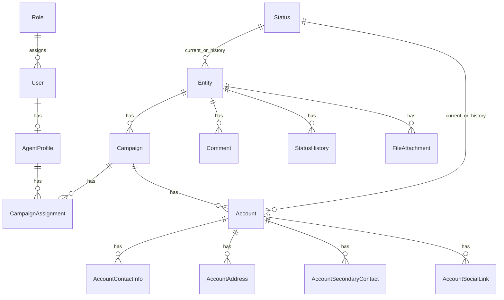

# 03 — Domain Model

Owns: entities, fields, relationships, schema conventions.  
Permissions → [05](05-security.md). Module UX → [04](04-modules.md) / [06](06-ui-standards.md).

## Vocabulary (locked)

| Term | Meaning |
|------|---------|
| **Entity** | The only name for the organization/person master record |
| **Campaign** | Work container under one Entity |
| **Account** | Account under one Campaign (Account Master module) |

**Forbidden synonyms in docs, UI labels, columns, and exports:** Client, Customer, Contracts (for Account).  
If you mean Entity, write **Entity**. If you mean Account, write **Account**.

## Ownership

Users do not own business records. Agent Profiles operate. Campaign Assignment bounds which **Campaigns** (and thus Accounts under them) are visible. Hierarchy:

```
Entity → Campaign → Account → child rows
```

## ER overview



## Access domain

### User

Username, Password, First Name, Last Name, Email, Mobile, Role, Status.  
`User 1 — 0..1 AgentProfile`.

### Role / Permission

Example roles: Super Administrator, Administrator, Supervisor, Agent, Viewer.  
CRUD + export (+ purge where applicable) per module — keys in [05](05-security.md).

### Agent Profile

Employee Number, First Name, Last Name, Display Name, Position, Department, Mobile, Email, Status, Notes.  
Future comms modules reference Agent Profile, not User.

### Campaign

FKs: `entity_id` (required).  
Fields: Campaign Code, Name, Description, Status. Operations: create, edit, archive.  
Belongs to exactly one Entity. Has many Accounts. Assignment of Agent Profiles via Campaign Assignment.

### Campaign Assignment

FKs: `campaign_id`, `agent_profile_id` (unique pair). Assignment UI from Campaign and Agent Profile sides.

## CRM domain

### Entity

Top-level master: Entity Code, Name, Birthdate, optional light identity fields, Custom Fields, Status, audit actors/dates.  
Has many Campaigns. Rich multi-contact/address/social data lives on **Account**, not as a flat Entity contacts module.

Statistics (CRM-only): created/updated by/dates, last status, last comment — no communication stats.

Entity tabs: Profile · Campaigns · Comments · History · Files · Statistics.

### Account (Account Master)

Hierarchy: `Entity → Campaign → Account`.  
Belongs to exactly one Campaign (`campaign_id`). Entity is reached via `account.campaign.entity` (no direct `entity_id` on accounts).

Core: Account Number, Product, Balance, Due Date, External Reference, Status, Notes.

First-class CRM listing + Campaign → Accounts (Entity shows Campaigns, not a flat Accounts tab as the parent path).

| Child | Requirement |
|-------|-------------|
| Contact Info | Multiple; types: email, phone/mobile, landline, fax; primary flag |
| Addresses | Multiple; type + full postal fields; primary flag |
| Secondary Contacts | Multiple people (name, relationship/role, channels, notes) |
| Social Links | Multiple URLs (LinkedIn, Facebook, X, Instagram, website, other) |

Lifecycle: soft delete; privileged **purge** (`accounts.purge`, audited) for account and children.

Account tabs: Profile · Contact Info · Addresses · Secondary Contacts · Social Links.

### Comment / Status History / File

Entity-level. Comments = chronological notes. Status History = from/to + actor + time. Files via Laravel Storage (filename, path, mime, size, uploader).

## Status Management

Master statuses (e.g. New, Active, Pending, Promise To Pay, Closed, Skip Trace) + categories + colors. Used by Entity/Account badges and history.

## Reporting & imports

Reports (logical): Entity, Campaign, Account, User summaries → Excel/CSV/PDF.  

Import batches (recommended tracking): Entities; Campaigns; Accounts; Account Contact Info / Addresses / Secondary Contacts / Social Links. CSV/Excel.

## Governance

**Audit log** (fields): actor user (+ agent profile), action, subject type/id, campaign id (nullable when subject is Entity-only), metadata, occurred_at. Events listed in [05](05-security.md).  

**Settings:** general, company info, lookup tables (contact types, address types, social platforms), system config.

## Schema conventions

| Concern | Standard |
|---------|----------|
| PK | `id` |
| FKs | Explicit, indexed |
| Soft delete | `deleted_at` on significant business rows |
| Timestamps | `created_at`, `updated_at` |
| Actors | `created_by`, `updated_by` |
| Scope path | `campaigns.entity_id` · `accounts.campaign_id` · Entity for comments/files |
| Names | Tables plural snake_case; models singular PascalCase |

Index FKs, status filters, unique codes (`campaign_code`, `entity_code`, username, employee number, account number per campaign), unique assignment pair.

### Target columns (Phase 1)

| Table | Key columns |
|-------|-------------|
| `entities` | `entity_code` (unique), `name`, `birthdate`, `custom_fields`, `status_id`, actors, soft delete |
| `campaigns` | `entity_id`, `campaign_code` (unique), `name`, `description`, `status`, actors, soft delete |
| `accounts` | `campaign_id`, `account_number`, `product`, `balance`, `due_date`, `external_reference`, `status_id`, `notes`, actors, soft delete |

**Removed / never use:** `campaigns.client`, `entities.customer_name`, `accounts.client_reference`, `entities.campaign_id`, `accounts.entity_id`.

## Anti-patterns

- Calling Entity “Client” or “Customer” in UI, docs, or column names  
- `user_id` as ownership/security key on business rows  
- Assigning campaigns to Users  
- Orphan Campaign without Entity, or Account without Campaign  
- Naming the account module “Contracts”  
- Building Knowledge Center in Phase 1  
- Putting all multi-channel contact data only on Entity instead of Account  
- Nesting Entity under Campaign
