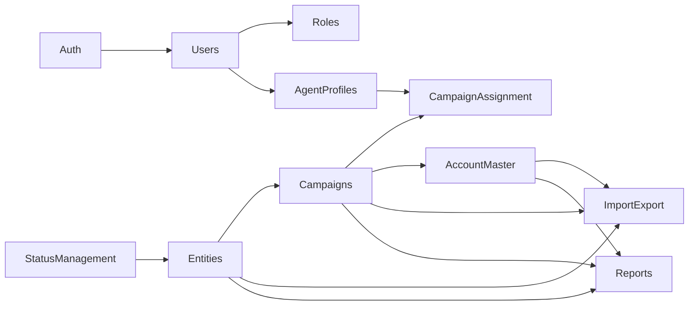

# 04 — Modules

Owns: module purpose, features, screens, nav groups.  
Fields → [03](03-domain-model.md). AuthZ → [05](05-security.md). UI patterns → [06](06-ui-standards.md).

Every listable screen uses the standard listing (search, filters, sort, pagination, export). Export is a per-module role permission.

**Vocabulary:** UI and nav say Entity / Campaign / Account only — never Client, Customer, or Contracts.

---

## Authentication

Login · Forgot password · Change password · User profile. Laravel Auth. Audit login/logout.

## Dashboard

Widgets: Total Entities, Campaigns, Accounts, Users · Recent activity. Campaign-scoped where applicable. No communication stats.

## Users

CRUD identities; link `0..1` Agent Profile; enable/disable. Admins may omit profile; operators should have one.

## Roles & Permissions

Seed roles: Super Admin, Admin, Supervisor, Agent, Viewer.  
Matrix: view/create/update/delete/export (+ archive/purge where needed). Roles UI exposes Export beside CRUD. Policies/Gates. Audit permission changes.

## Agent Profiles

Operational staff CRUD; link to User; assignment of campaigns (shared with Campaign Assignment UX).

## Entities

Top-level master (has many Campaigns). Detail tabs: Profile · Campaigns · Comments · History · Files · Statistics. Listing + `entities.export`.

## Campaigns

Belongs to one Entity. Create / edit / archive. Assignment of agents from campaign screen. Accounts listed under the Campaign (and via Account Master nav).

## Campaign Assignment

Primary security boundary. Assign/remove Agent Profiles ↔ Campaigns (both sides). Audit changes. Never assign to Users.

## Account Master

Account under Campaign (`Entity → Campaign → Account`). CRM nav listing + Campaign → Accounts.

Detail tabs: Profile · Contact Info · Addresses · Secondary Contacts · Social Links.  
Soft delete + `accounts.purge`. Batch import via Import module. Permissions: `accounts.view/create/update/delete/export/purge`.

## Status Management

Status CRUD, categories, colors. Seed defaults. Entity status changes write history.

## Reports

Entity / Campaign / Account / User summaries. Export Excel/CSV/PDF. Scoped + audited.

## Import

CSV/Excel: Entities, Campaigns, Accounts, Contact Info, Addresses, Secondary Contacts, Social Links. Validate, error report, entity/campaign context, audit, templates.

## Export / Download

On **every** listing toolbar. Per-module `{module}.export`. Hide without permission; server enforce; audit; campaign scope; honor listing filters.

## Audit Logs

Searchable/filterable log of security and data-movement events ([05](05-security.md)). Privileged roles only.

## Settings

General · Company · Lookups · System config. Permission-gated.

---

## Admin nav groups

| Group | Items |
|-------|--------|
| Overview | Dashboard |
| CRM | Entities, Campaigns, Account Master, Status Management |
| Operations | Reports, Import |
| Administration | Users, Roles & Permissions, Agent Profiles, Audit Logs, Settings |
| Future | Disabled placeholders (Knowledge Center, SMS, Calling, Email, Messaging, AI, Analytics) |

Campaign Assignment UX remains on Campaign and Agent Profile screens (optional admin shortcut allowed).

## Dependencies

Build order: [08](08-implementation-roadmap.md).
