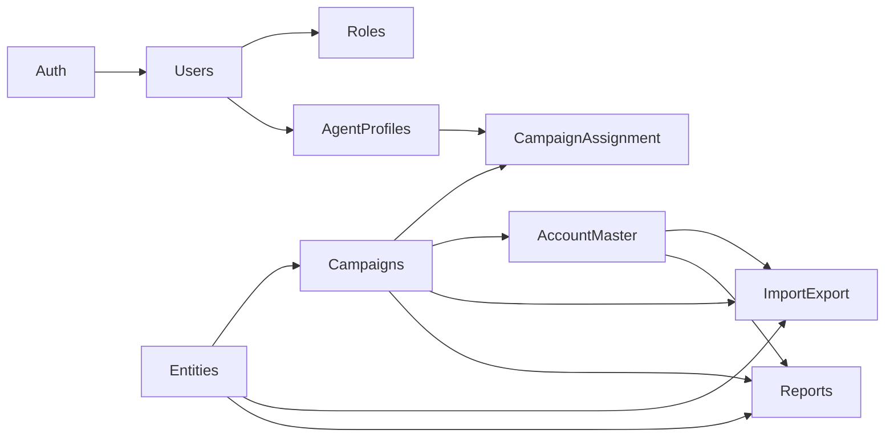

# 04 — Modules

Owns: module purpose, features, screens, nav groups.  
Fields → [03](03-domain-model.md). AuthZ → [05](05-security.md). UI patterns → [06](06-ui-standards.md).

Every listable screen uses the standard listing (search, filters, sort, pagination, export). Export is a per-module role permission.

**Vocabulary:** UI and nav say Entity / Campaign / Account only — never Client, Customer, or Contracts.

---

## Authentication

Login · Forgot password · Change password · User profile. Laravel Auth. Audit login/logout.

## Dashboard

Widgets: Activity today (per Entity: Campaign × Status activity counts for today) · Account Portfolio Summary (Entity filter; status counts per accessible Campaign; drill-down to Account Master in new tab; excludes template entity) · Agents (Online = login audit today, else Offline; last activity as time ago). Campaign-scoped. No communication stats.

## Users

CRUD identities; link `0..1` Agent Profile; enable/disable. Admins may omit profile; operators should have one.

## Roles & Permissions

Seed roles: Super Admin, Admin, Supervisor, Agent, Viewer.  
Matrix: view/create/update/delete/export (+ archive/purge where needed). Roles UI exposes Export beside CRUD. Policies/Gates. Audit permission changes.

## Agent Profiles

Operational staff CRUD; link to User; assignment of campaigns (shared with Campaign Assignment UX).

## Entities

Top-level master (has many Campaigns). View tabs: Profile · Campaigns · Entity Statuses · Entity Action Codes · Templates · Knowledge Groups; later Comments · History · Files · Statistics. Knowledge Center items (text / URL / PDF) are managed on Knowledge Group Show after View from Knowledge Groups. Hard delete with type-name confirm cascades Campaigns/Accounts. Listing + `entities.export`.

## Campaigns

Belongs to one Entity. Create / edit / archive / delete. Assignment of agents from campaign screen (agents table on Campaign Show). Accounts via Account Master nav (not listed on Campaign Show).

## Campaign Assignment

Primary security boundary. Assign/remove Agent Profiles ↔ Campaigns (both sides). Audit changes. Never assign to Users.

## Account Master

Account under Campaign (`Entity → Campaign → Account`). CRM nav listing + Campaign → Accounts.

Detail tabs: Profile · Contact Info · Addresses · Secondary Contacts · Social Links.  
Soft delete + `accounts.purge`. Batch import via Import module. Permissions: `accounts.view/create/update/delete/export/purge`.

## Entity Statuses, Action Codes & Templates

Per-entity catalogs live under Entity Show (Entity Statuses / Entity Action Codes / Templates / Knowledge Groups). Account badges use Entity Status. Templates store SMS/email/chat body content with `{variable}` placeholders; they are not a messaging send product. Knowledge Groups drill down to Knowledge Group Show for Knowledge Center items (text / URL / PDF) — repository only, not AI/RAG/auto-reply. CRM nav also includes read-only Activity Types and Contact Types, plus Address Types.

## Reports

Entity / Campaign / Account / User summaries. Export Excel/CSV/PDF. Scoped + audited.

## Import

CSV/Excel: Entities, Campaigns, Accounts, Contact Info, Addresses, Secondary Contacts, Social Links. Validate, error report, entity/campaign context, audit, templates.

## Export / Download

On **every** listing toolbar. Per-module `{module}.export`. Hide without permission; server enforce; audit; campaign scope; honor listing filters.

## Audit Logs

Searchable/filterable log of security and data-movement events ([05](05-security.md)). Privileged roles only.

## Settings

General · Company · Lookups · System config. Permission-gated.

## SMS Queuing

Laravel owns the outbound SMS queue; the C++ SMS service sends only when Laravel calls `POST /api/v1/sms/send`. Permissions: `sms.view`, `sms.manage`, `sms.export`, `sms.queue.cancel`.

- **SMS Configuration** — config.json path, Laravel→C++ base URL, editable root sections (`service` / `logging` / `http` / `callbacks` / `queue`), **device group** master then devices under a group (AT / Huawei / GOIP / Demo); Demo devices emit `demo_send_success_rate` + `demo_receive_interval_seconds` in `config.json`; writes full `config.json` on save. Does **not** auto-start the C++ service (start/stop manually from SMS Dashboard; optional exe path is for that only).
- **SMS Dashboard** — separate from CRM Dashboard; start service; devices shown **by group** as compact health-colored cards (sent/failed counts; green/red gradient); unmatched inbound SMS top 3; peek at recent batches; session uptime + sent count; no-device / service-down alerts. Live service status comes from poll (not Inertia stubs).
- **SMS Batches** — Operations module for **all** batches (queued, paused, completed, cancelled, failed): listing + show, pause/resume/priority, cancel remaining queued (deletes linked SMS Send activities), edit queued item message/recipient, hard-delete when nothing is sending; export (`sms.export`).
- **SMS Callbacks** — Operations listing of ingested callback events (`sms_callback_events`): search/filter by event type, response, device; view payload; export (`sms.export`).
- **Enqueue** — Account Show / Accounts bulk Add Activity when type is SMS Send + **Queue in SMS** → choose **round robin to device group** or **specific device** → `sms_batches` + `sms_queue_items` (true RR cursor on the group).
- **Callback** — `POST /api/sms/callback` (X-API-Key, idempotent on `event_id`).
- **Worker** — `php artisan sms:dispatch` (scheduled) / `php artisan sms:work` (loop).

---

## Admin nav groups

| Group | Items |
|-------|--------|
| Overview | Dashboard, SMS Dashboard |
| CRM | Entities (Campaigns / Statuses / Action Codes / Templates / Knowledge Groups on Entity Show; Knowledge Center on Group Show), Account Master |
| Operations | Reports, Import, SMS Batches, SMS Callbacks, SMS Configuration |
| Administration | Users, Roles & Permissions, Agent Profiles, Audit Logs, Settings, Demo Mode (template/demo data tool) |
| Future | Disabled placeholders (standalone Knowledge Center product, Calling, Email, Messaging, AI, Analytics) |

Campaign Assignment UX remains on Campaign and Agent Profile screens (optional admin shortcut allowed).

## Dependencies

Build order: [08](08-implementation-roadmap.md).
