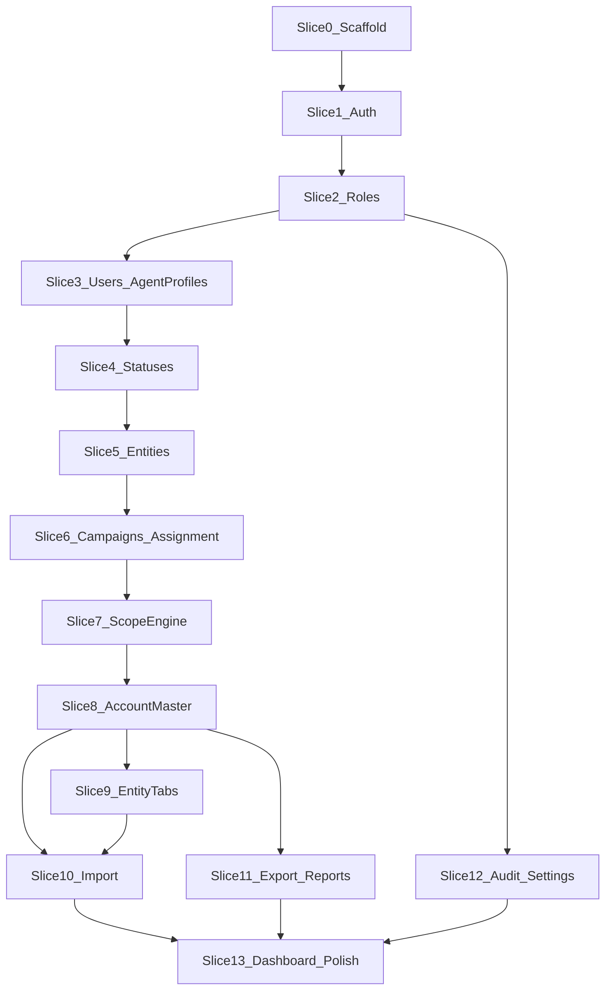

# 08 — Implementation Roadmap

Owns: build order only.  
Scope → [01](01-vision-and-scope.md). Domain → [03](03-domain-model.md). Modules → [04](04-modules.md). Stack/UI → [07](07-technical-standards.md) / [06](06-ui-standards.md).

Finish each slice’s baseline before expanding sideways. Hierarchy: **Entity → Campaign → Account**. Knowledge Center is out of Phase 1. Never use Client/Customer as synonyms for Entity.

## Sequencing principles

1. Auth + shell  
2. RBAC  
3. Users + Agent Profiles  
4. Statuses → **Entities**  
5. **Campaigns + Assignment** (Campaign requires Entity)  
6. **Campaign scope engine** before Account CRUD  
7. Account Master → Entity tabs  
8. Import → Export/Reports → Audit/Settings → Dashboard polish  

---

### Slice 0 — Scaffold

Laravel 12 + Breeze Vue/Inertia + PrimeVue + Tailwind + MariaDB + admin shell + design tokens + shared listing stubs + nav groups.  
Exit: login + empty authenticated shell.

### Slice 1 — Auth

Login/logout, forgot/change password, self profile. Audit login/logout.

### Slice 2 — Roles & permissions

Seed roles; permission keys including `*.export` (+ `accounts.purge` later); Roles UI with Export toggles; policies; audit permission changes.

### Slice 3 — Users & Agent Profiles

Users CRUD; Agent Profiles CRUD; `0..1` link; operators should have profiles.

### Slice 4 — Status Management

CRUD, categories, colors, seed defaults.

### Slice 5 — Entities

Entity CRUD + standard listing (`entities.export`) + profile. Soft deletes + audit actors. No Client/Customer labels — fields use Entity Code / Name.

### Slice 6 — Campaigns & Assignment

Campaign under Entity (`entity_id`); CRUD/archive; assignment model + unique pair; assign UI both sides; audit.

### Slice 7 — Scope engine

Current agent profile · allowed campaign IDs · shared query scope · Entity visible if ≥1 assigned campaign · Super Admin bypass · IDOR tests.

### Slice 8 — Account Master

Accounts under Campaign: listing + Campaign Accounts; full profile; Contact Info / Addresses / Secondary Contacts / Social Links; soft delete + `accounts.purge`; policies/permissions. Spec: [03](03-domain-model.md), [04](04-modules.md).

### Slice 9 — Entity supporting tabs

Campaigns tab · Comments · Status History · Files · Statistics (CRM-only).

### Slice 10 — Import

Batch CSV/Excel: Entities, Campaigns, Accounts, Account children. Validation, templates, scope, audit.

### Slice 11 — Export & Reports

Export on every listing; complete role matrix; Entity/Campaign/Account/User reports; scoped + audited.

### Slice 12 — Audit UI & Settings

Audit listing/filters; settings + lookups (contact/address/social types).

### Slice 13 — Dashboard polish

Scoped widgets; Future placeholders; consistency + responsive pass. Exit: [01 success criteria](01-vision-and-scope.md).

---

## Dependency diagram

## Parallelization (after Slice 7)

- Audit UI once audit writes exist  
- Export/Reports after Slice 8; Import can parallel Reports  
- Do not start Account CRUD before Slice 7  

## Not in this roadmap

Knowledge Center · SMS/Calling/Email/Messaging products · AI/RAG · Docker/K8s/microservices · React/Livewire-primary UI · module named “Contracts” · labels Client/Customer for Entity
